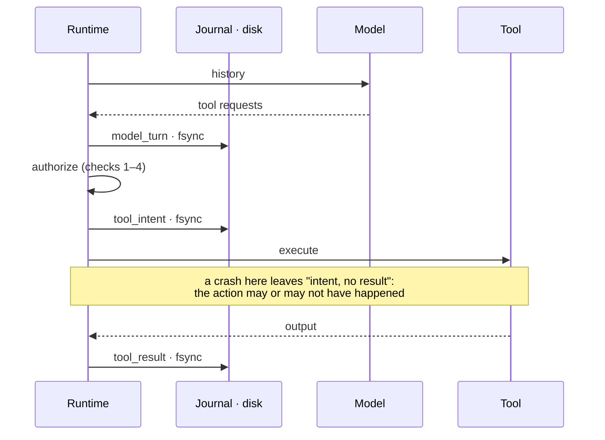
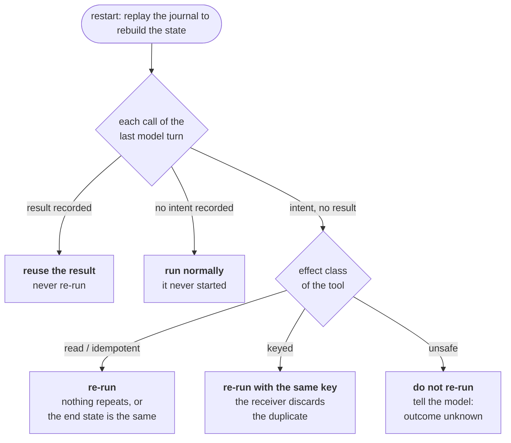

# Stage 3 — Resumable Agent

The Stage 2 agent loses everything when its process dies: the history, the spend,
and, worse, the knowledge of which actions already happened. A naive restart
re-executes them. This stage makes a run durable with a write-ahead journal, so a
killed run resumes without silently repeating completed side effects.

## Files

| File | Purpose |
|---|---|
| `journal.py` | Append-only, fsync'd journal (JSON lines); torn final writes discarded, earlier damage reported. |
| `durable_agent.py` | The Stage 2 loop with every state change journaled before it takes effect; state rebuilt by replay. |
| `effects.py` | Two side-effecting tools: `send_message` (external service with idempotency keys) and `append_note` (no protection). |
| `scripted.py` | A scripted model whose answer depends only on conversation progress, so a restarted process sees the same model. |
| `crash_demo.py` | The experiment: kill the process mid-action (`os._exit`), restart, count effects. |
| `test_durable.py` | 19 offline tests: every crash point, budgets across restarts, journal damage, and the real-kill experiment. |

```bash
source ../01-llm-runtime/.venv/bin/activate
python -m unittest -v          # offline, ~1 s
python crash_demo.py           # offline, free
```

## Design

**State is a fold over the journal.** Every change to a run is a record appended to
the journal and fsync'd *before* it is applied in memory. The in-memory state is a
cache; on restart it is rebuilt by replaying the records through the same transition
function used live. Nothing else survives a crash, by construction.

**Event history is not model context.** The journal holds more than the model ever
sees: intents, costs, recovery decisions. The model's context (the history re-sent at
each step) is derived from it.

**The critical record is the intent.** Before an authorized tool call executes, a
`tool_intent` record is made durable; after it executes, a `tool_result`. On restart,
each call of the last model turn is in one of three states, and the runtime's response
is determined by the state and by the tool's declared effect class:




| Journal shows | Meaning | Recovery |
|---|---|---|
| no intent | never started | authorize and run normally |
| intent and result | completed | reuse the recorded result; never re-run |
| intent, no result | **may or may not have run** | depends on the effect class ↓ |

| Effect class | Examples | On "intent, no result" | Resulting semantics |
|---|---|---|---|
| `read` | `read_file`, `search` | re-run | no effect to repeat |
| `idempotent` | `write_file` (full overwrite, atomic) | re-run | same end state |
| `keyed` | `send_message` | re-run with the **same** idempotency key (`run_id:call_id`); the receiver discards the duplicate | effectively once |
| `unsafe` | `append_note` | **not** re-run; the model is told "outcome unknown" | at most once |

The complete recovery rule:



The `unsafe` rule is deliberately conservative. A crash between intent and execution
also leaves "intent, no result", although the action never ran; the runtime cannot
distinguish the two cases, so it refuses both, trading possible loss for no
duplication.

**Model turns are recorded outputs, not re-computed ones.** A recorded model turn is
never re-requested on replay: the model is nondeterministic, so asking again could
yield a different decision than the one whose consequences are already in the
journal, and every call is billed. This is the state-machine-replication rule of
logging nondeterministic inputs rather than recomputing them.

**Transient provider failures pause instead of ending.** The run returns `paused`
without a `run_finished` record, and a later invocation resumes it.

## Experiment

`crash_demo.py`: the agent reads a failing test log and performs one side effect.
The child process is killed with `os._exit(137)` immediately after the effect happens
and before its result is journaled, which is the window a restart cannot see into. The
run is then restarted.

```text
runtime   action         killed  effects  recovery                                   outcome
naive     send_message   yes     2        restarted from scratch                     answered
naive     append_note    yes     2        restarted from scratch                     answered
durable   send_message   yes     1        re-executing (keyed)                       answered
durable   append_note    yes     1        outcome unknown, not re-executed (unsafe)  answered
```

The naive runtime (Stage 2) duplicates every effect. The durable runtime performs
each exactly once, by two different mechanisms: deduplication by key where the
receiver supports it, and refusal to retry where it does not.

A design error in the first version of this experiment is worth recording: the
simulated message service treated a missing idempotency key as a key, so two keyless
(naive) deliveries were deduplicated as `None == None` and the naive runtime appeared
safe. Deduplication requires a key the sender actually supplies.

## Guarantees

- **No completed action is re-run.** A recorded result is always reused.
- **No side effect is silently repeated.** Keyed effects are deduplicated by the
  receiver; unsafe effects are never automatically retried.
- **Decisions are stable across restarts.** Recorded model turns and recorded
  refusals are replayed, not re-decided.
- **Budgets survive restarts.** Spend and step counts are rebuilt from the journal, so
  a crash cannot reset a budget.

## Non-guarantees

- **In-flight model calls are paid twice and counted once.** A model call that returns
  but crashes before its turn is journaled is re-requested on restart; its cost never
  reached the journal. The budget can therefore undercount by one call per crash. (A
  test asserts this gap rather than hiding it.)
- **"Outcome unknown" needs someone to resolve it.** For unsafe actions the runtime
  guarantees at most once, not exactly once; the model or a human must check.
- **Keyed deduplication depends on the receiver.** Effectively-once holds only for
  services that honor idempotency keys.
- **Context grows without bound.** The full history is still re-sent every step;
  selection and compaction are not implemented.
- **One process per journal.** Two processes resuming the same run concurrently would
  interleave records; excluding that requires a lease (Stage 8).
