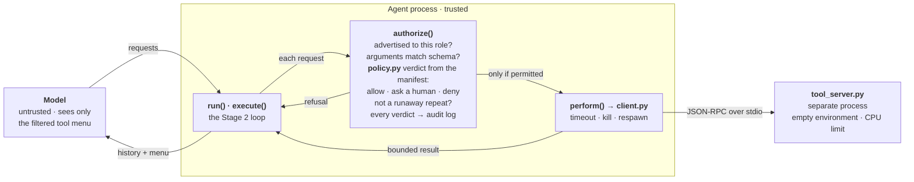

# Stage 4 — Capability Security

Useful work without ambient authority. Stage 2 enforced one rule, *stay inside the
workspace*. Real agents need more authority than that and read untrusted text all
day, so the question here is how much authority an agent should hold at all, and
where that limit is enforced. The answer is the same as before: in the runtime,
independently of whether the model cooperates.

## At a glance



## Files

| File | Role | Runs in |
|---|---|---|
| `manifests/code-reviewer.toml` | The role's policy: tools allowed / requiring approval / denied (default), secret path patterns, permitted network destinations. | configuration |
| `manifests/pins.json` | Fingerprints (SHA-256) of each approved tool declaration. | configuration |
| `policy.py` | Decides each request from the manifest: allow, ask, or deny, with a reason. | agent process |
| `secure_agent.py` | The Stage 2 loop with a new `authorize()` (manifest, approver, audit) and `perform()` (via the tool process). | agent process |
| `client.py` | Starts and talks to the tool process; enforces the timeout by killing it. | agent process |
| `tool_server.py` | Lists and executes tools (MCP-style: `tools/list`, `tools/call`). The only place tools act. | separate process |
| `test_policy.py`, `test_sandbox.py`, `test_secure_agent.py` | 22 offline tests: decisions, the process boundary, the whole agent. | — |

Reused: the loop from `02-single-agent/agent.py`, the tool functions from
`02-single-agent/tools.py`, the model adapter from `01-llm-runtime/llm.py`.

```bash
source ../01-llm-runtime/.venv/bin/activate
python -m unittest -v          # offline, ~2 s
python client.py > manifests/pins.json   # re-pin after reviewing a tool change
```

## How a run flows

1. **Startup.** `secure_agent.py` asks the tool process for its tools and keeps only
   those the role is granted *and* whose declaration matches its pin. Denied tools
   are not advertised; changed declarations are quarantined. The model's tool menu is
   the filtered list.
2. **Each request** goes through the inherited `execute()`, which calls the new
   `authorize()`:
   1. Is the tool on this role's menu?
   2. Do the arguments match its declared schema?
   3. What does the manifest say? Paths must resolve inside the workspace and must not
      match a secret pattern (symlinks resolved first); network destinations must be
      permitted. Then **allow**, **deny**, or **ask**: the human approver sees the exact
      request, and without an approver, ask means deny.
   4. Is it a runaway repeat?

   Every verdict is appended to the audit log.
3. **Only a permitted request** reaches `perform()`, which sends it to the tool process
   and waits at most the timeout; an overrunning process is killed and replaced.
4. The result is size-capped and returned to the loop.

The model can request anything, including tools it was never shown. Hiding a tool is
a convenience; the refusal in `authorize()` is the protection. Every request passes
through the same checks: there is no other path from model output to the tool process.

## Guarantees

- **Least privilege per role.** Only granted tools can run; everything else is denied by
  default and not advertised.
- **Secrets are withheld by policy.** Paths matching secret patterns are refused, for
  every tool, after symlink resolution.
- **No inherited credentials.** The tool process starts with an empty environment.
- **Changed tools are not trusted.** A declaration that no longer matches its pin never
  reaches the model; re-pinning is an explicit, reviewed step.
- **Sensitive actions need a person.** "Ask" requires an approver who sees the exact
  request.
- **Accountability.** Every decision is recorded with its reason.
- **Real termination.** An overrunning tool is killed, fixing the Stage 2 limitation of
  abandoned threads.

## Non-guarantees

- **Not an operating-system sandbox.** The tool process has a clean environment and a CPU
  limit but runs as the same user, with that user's file and network access. Container
  isolation comes in Stage 7.
- **Secret patterns are only as complete as the list.** A credential in an unlisted file
  is readable by a granted tool.
- **Approval is only as good as the approver.** Approving by habit turns "ask" into
  "allow".
- **Decisions are per request.** The gate does not reason about sequences of individually
  permitted actions; the defense is to grant as little as possible.
- **The trusted base includes the code, the manifest, the pins and the tool
  implementations.** Whoever can change them changes the rules; pinning checks a tool's
  declaration, not its implementation.
