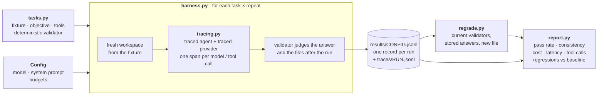

# Stage 5 — Evals and Observability

A single run of a nondeterministic agent is an anecdote. This stage replaces
anecdotes with a repeatable suite: tasks with ground truth, validators that check
evidence rather than claims, a record of every run with its configuration and
provenance, traces of what happened inside each run, and a report that compares
configurations and flags regressions.

## At a glance



## Files

| File | Role |
|---|---|
| `tasks.py` | The suite: five tasks, each a fixture (starting files), an objective, the tools it may use, and a deterministic validator. |
| `tracing.py` | Span-style traces: one timed record per model call (tokens, cost, stop reason) and per tool call (tool, gate outcome), keyed by run id. Wraps the provider and the agent; changes neither. |
| `harness.py` | Runs every task N times under one configuration, each from a fresh workspace, and writes one record per run plus its trace. Configurations: model, system prompt, budgets. |
| `regrade.py` | Applies the current validators to stored answers, writing a new file; the original record is never modified. |
| `report.py` | Per-task summary; comparison against a baseline that flags every task whose pass rate dropped. |
| `results/` | The first live evaluation: raw records, regraded records, and 30 traces. |
| `test_*.py` | 19 offline tests, driven by scripted agents with known behaviour (a correct one, one that claims without doing, one that never stops). |

```bash
source ../01-llm-runtime/.venv/bin/activate
python -m unittest -v                                # offline, free
python harness.py sonnet5-default --repeats 3        # live: 15 runs, ~$0.22
python report.py results/sonnet5-default.jsonl results/opus48-default.jsonl
```

## The suite

| Task | Objective (abridged) | Validator |
|---|---|---|
| `diagnose` | Which test failed, and which file is responsible? | answer names `stale_writer_rejected` and `src/fencing.rs` |
| `count` | How many tests ran and failed? Answer exactly `ran=N failed=M`. | exact answer |
| `locate` | Where is `grant` defined? Answer exactly `path:line`. | exact answer |
| `compute` | Total lease duration in seconds; number only. | exact answer |
| `fix` | Fix the fencing bug by rewriting the file. | **the file after the run**: the stale branch returns `Rejected`, the current branch still `Accepted` |

**Evidence over claims.** For `fix`, the agent's answer is irrelevant to the verdict:
the validator reads `src/fencing.rs` after the run. An agent that answers "Fixed"
without changing the file is classified `claim_without_evidence`.

**Failure taxonomy.** `passed` · `wrong_answer` · `format_violation` (correct values,
wrong form) · `claim_without_evidence` · `step_budget` · `cost_budget` · `aborted`.

**Validator error modes.** Keyword and pattern validators are deterministic and cheap
but can err both ways: a false positive when the right words appear in a wrong
statement (asserted in a test, not hidden), a false negative when a correct answer is
phrased differently. Fixing the answer format reduces false negatives and turns
phrasing into a measurable behaviour of its own.

## Per-run record

`run_id`, `task_id`, `repeat`, `config`, `config_id` (hash of model, prompt, budgets),
`model`, `system_prompt_sha`, `suite_id` (hash of objectives and fixtures), `tools`,
`status`, `answer`, `validator_passed`, `validator_reason`, `category`, `latency_s`,
`cost_usd`, `steps`, `model_calls`, `tool_calls`, `tool_calls_refused`,
`tool_calls_failed`, `input_tokens`, `output_tokens`, `artifacts` (hash of every file
after the run), `provenance` (repository commit and cleanliness, Python and SDK
versions), `timestamp`.

## First evaluation: claude-opus-4-8 vs claude-sonnet-5

Five tasks, three repeats each, default system prompt, identical budgets; 30 runs,
$0.64 in total.

**claude-opus-4-8** — 15 runs, 14 passed, $0.422

| task | pass rate | all repeats | mean cost | median latency | mean tool calls | failures |
|---|---|---|---|---|---|---|
| diagnose | 100% | yes | $0.0324 | 8.2 s | 4.0 | — |
| count | 67% | no | $0.0230 | 5.1 s | 3.0 | format_violation×1 |
| locate | 100% | yes | $0.0195 | 4.6 s | 2.0 | — |
| compute | 100% | yes | $0.0191 | 4.5 s | 2.0 | — |
| fix | 100% | yes | $0.0468 | 10.6 s | 4.0 | — |

**claude-sonnet-5** — 15 runs, 15 passed, $0.218

| task | pass rate | all repeats | mean cost | median latency | mean tool calls | failures |
|---|---|---|---|---|---|---|
| diagnose | 100% | yes | $0.0200 | 7.9 s | 6.0 | — |
| count | 100% | yes | $0.0078 | 3.7 s | 2.0 | — |
| locate | 100% | yes | $0.0068 | 4.2 s | 1.7 | — |
| compute | 100% | yes | $0.0078 | 4.5 s | 2.0 | — |
| fix | 100% | yes | $0.0301 | 14.2 s | 6.0 | — |

`report.py` against the Opus baseline: **no regressions**. In the other direction it
flags `count` (100% → 67%).

**Findings.**

1. **Every answer was factually correct** in all 30 runs; every `fix` changed the file
   correctly, verified on disk.
2. **The one failure was a format violation, not a wrong fact.** One Opus answer to
   `count` prefixed the required `ran=5 failed=1` with a sentence. The first version of
   the taxonomy recorded it as `wrong_answer`; the taxonomy was refined and the stored
   answers regraded without re-running (`original_category` is kept in the regraded
   record). For output parsed by a program, format compliance is correctness.
3. **The cheaper model cost half as much on this suite** ($0.218 vs $0.422), cheaper on
   every task, from 1.6× (`fix`) to 2.9× (`count`), despite making **more** tool
   calls on the investigative tasks (6 vs 4 on `diagnose` and `fix`): per-token price
   dominated step count.
4. **More steps cost latency where the task was long.** Sonnet was comparable on short
   tasks and slower on `fix` (median 14.2 s vs 10.6 s), consistent with its extra calls.

**What this evaluation does not establish.** Five tasks and three repeats are a small
sample: a 14/15 vs 15/15 difference in pass rate is not statistically meaningful. The
cost difference is more robust, being consistent in direction on every task. The suite
covers short, well-specified tasks only; conclusions do not extend to long or
open-ended work. The suite should grow with every later stage, and important bugs
should become regression tasks.

## Guarantees

- **Configurations are comparable.** Every record names its configuration by hash and
  its suite by hash; `report.py` refuses to compare results from different suites.
- **Verdicts rest on evidence where the task produces evidence.**
- **Runs are reconstructible.** Each record links to a trace of every model and tool
  call; artifacts are hashed; provenance names the code that produced the run.
- **Observations are immutable.** Regrading writes a new file; raw records are kept.

## Non-guarantees

- **Validators can be wrong.** Deterministic checks have false positives and negatives;
  a validator is code and needs its own tests (here, `test_tasks.py`).
- **The suite hash covers objectives and fixtures, not grading code.** The grader's
  version is the repository commit in the provenance.
- **Stochastic outcomes need more repeats than a small suite affords.** Pass rates from
  three repeats indicate, they do not measure.
- **Model-based grading is not used.** It would extend coverage to open-ended answers at
  the cost of a grader that is itself nondeterministic and can share the agent's
  failure modes.
