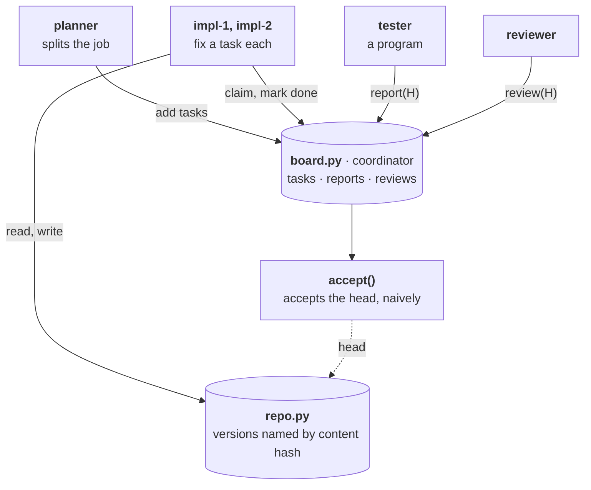

# Stage 6 — Multi-Agent Coordination, One Machine

Several agents share one software task: a planner splits it, two implementers work
on the pieces concurrently, a tester and a reviewer check the result, and a trusted
coordinator decides acceptance. The coordination is **deliberately naive**, and each
failure the plan lists is reproduced on demand and documented. The failures are the
requirements for the next stages; they are not fixed here.

## At a glance



## Files

| File | Role |
|---|---|
| `repo.py` | Content-addressed repository: each version is named by the SHA-256 of its contents; history is immutable; writes are naive (applied to the current head, whatever the writer read). |
| `software.py` | The task: one Rust file with two independent bugs, a changelog, and a deterministic test suite. |
| `board.py` | The coordinator's board: tasks, test reports, reviews, acceptance. Naive: no ownership checks, no version checks, held in memory. Every action is recorded with its version. |
| `agents.py` | Scripted planner, implementers, tester, reviewer and coordinator, each a generator pausing after every action on shared state; a deterministic scheduler that resumes them in an explicit order. |
| `scenarios.py` | The correct concurrent baseline and the six failures, each an explicit schedule; a diagnosis that reads the version-tagged record. |
| `test_*.py` | 18 offline tests: content addressing, the naive board, scheduler determinism, and every failure reproduced on demand. |

```bash
source ../01-llm-runtime/.venv/bin/activate
python -m unittest -v       # offline, deterministic, free
python scenarios.py         # print every scenario's timeline and diagnosis
```

## Design decisions

- **Why several agents at all.** Multiple agents are justified only by parallelism,
  specialization, isolation or independent verification. With one implementer, a
  planner has nothing to plan; the task therefore has **two independent bugs**, so the
  planner produces two tasks and two implementers work in parallel. That is also what
  makes ownership and write conflicts possible.
- **The tester is a program, not an agent.** Running tests is deterministic; evidence
  should come from deterministic checks (Stage 5), not from a model's opinion. The
  reviewer is justified by independent verification, with the caveat that a reviewer
  using the same model as the implementer is correlated with it.
- **A shared board rather than point-to-point messages.** All shared state is in one
  place and inspectable. Staleness does not disappear (agents read the board at
  different moments), but it becomes a visible read-then-write pattern.
- **Versions named by content.** Every artifact that depends on the code carries the
  identifier of the version it refers to: a patch names its base, a test report and a
  review name the version examined. Staleness becomes a comparison of identifiers. The
  naive board records the identifiers and ignores them; the diagnosis uses them.
- **Scripted agents under a deterministic scheduler.** Each failure is an interleaving;
  forcing it makes it reproducible exactly, on demand, at no cost. A live run with real
  models shows which failures occur unforced; it is not needed to establish them.

## The failures

| | Failure | What the record shows | Diagnosis | Mechanism that prevents it |
|---|---|---|---|---|
| a | Two workers claim the same task | T1 had two owners at once; T1 carried out twice | race on check-then-act: both read "T1 open" before either claimed | atomic conditional claim (compare-and-set); then leases and fencing tokens |
| b | The reviewer approves a stale version | the accepted version has no review; the review is of an older version | stale read: evidence about an older version than the one decided on | version-tagged evidence, checked at acceptance |
| c | Tested version A, accepted version B | the accepted version has no passing test report, and fails `grant_increments` | evidence and decision refer to different versions | accept H only if a passing report and an approval are both for H and H is still the head |
| d | A finished action is repeated | T1 carried out twice by one worker | at-least-once retry without deduplication | idempotency key per action, deduplicated by the receiver |
| e | Conflicting edits to one file | T1 marked done, its fix absent from the head; nothing accepted | lost update: both read H0, the second write discarded the first | optimistic concurrency: a write names its base and is rejected if the head moved |
| f | The coordinator crashes | the restarted board forgot T1 done and T2 claimed; T1 carried out twice | volatile coordinator state | a durable board (a journal, as in Stage 3); then replication by consensus |

**Observations.**

1. **Five of the six failures end in an acceptance.** The naive coordinator accepted in
   a, b, c, d and f; in c it accepted a version that fails its tests. Only e stalled,
   and only because the tester happened to run after the lost update.
2. **The version identifiers make every failure detectable**, although nothing in the
   naive system checks them. Detection is a comparison of identifiers; prevention
   requires the coordinator to refuse what the comparison reveals.
3. **Duplicated effects arise from three different mechanisms**: a stale read of the
   board (a), a retry without deduplication (d) and a coordinator that forgot completed
   work (f). One symptom, three causes, three different fixes.
4. **A review that does not examine the evidence verifies nothing.** In e the reviewer
   approved a version whose tests had just failed. Independent verification requires the
   verifier to look at evidence, a point the multi-agent failure taxonomy MAST also
   identifies as a major class of failures (Cemri et al., NeurIPS 2025).

## Requirements for the next stages

- **Ownership** that is exclusive, expires, and rejects late holders: conditional
  claims, leases, fencing tokens.
- **Versioned writes**: every write names its base version; conflicting writes are
  rejected, not silently merged.
- **Version-bound acceptance**: accept a version only on evidence about that version,
  while it is still the head.
- **Idempotent actions**: every externally visible action carries a key the receiver
  deduplicates.
- **A durable coordinator**, then a replicated one.

Stage 7 moves the workers into separate processes and machines; Stage 8 builds the task
ledger that implements the first four requirements; Stage 9 replicates it.

## What this stage does not establish

- **How often these failures occur unforced.** The schedules force them; their frequency
  in real runs depends on timing and on the models, and needs a live experiment.
- **Anything about model quality.** The agents are scripted: the failures belong to the
  coordination, not to the models, which is the point.
