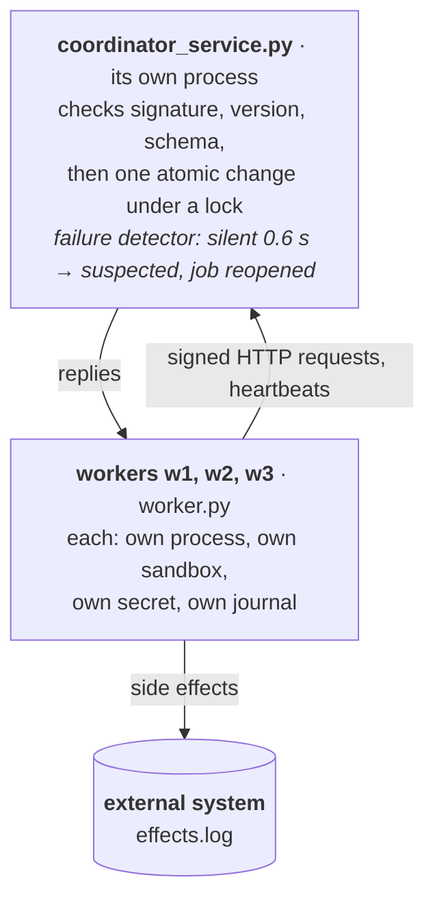

# Stage 7 — Distributed Sandboxed Workers

Until now every agent lived in one program and shared its memory. Here each worker
is a separate operating-system process with its own working directory and its own
credentials, and the coordinator is a separate server process that workers reach
over HTTP. Messages can now be late, lost, forged or malformed, and a worker can die
or freeze at any moment. The exit criterion: **killing one worker cannot corrupt
another worker's state, and the coordinator detects the loss and recovers.**

This is the single-host stage of the plan (separate processes on one machine); the
same design moves to containers on a dedicated lab host next.

## At a glance



## Files

| File | Role |
|---|---|
| `protocol.py` | The wire format: versioned JSON messages validated with Pydantic; HMAC-SHA256 request signing with a per-worker secret, constant-time comparison and a replay window. |
| `coordinator_service.py` | The coordinator as an HTTP server process. Every request is authenticated, version-checked and schema-validated before one atomic state change under a lock. A heartbeat failure detector suspects silent workers and reopens their jobs. Completions from non-owners are refused; retried completions are idempotent. |
| `rpc.py` | The client: signed requests, timeouts, retries with exponential backoff and jitter. |
| `worker.py` | A worker process configured only by its environment: heartbeats in the background, claims jobs, journals locally in its sandbox, writes its side effect to an external system, reports completion. |
| `cluster.py` | Starts the coordinator and workers as real processes with minimal environments, and injects failures with real signals (SIGKILL, SIGSTOP, SIGCONT). |
| `experiments.py` | Five experiments on a fresh cluster each: baseline, crash, freeze, lost replies, forged requests. |
| `test_protocol.py`, `test_cluster.py` | 11 tests; the cluster tests are the exit criterion, on real processes, in about 6 seconds. |

```bash
source ../01-llm-runtime/.venv/bin/activate
python -m unittest -v        # offline, free, ~6 s
python experiments.py        # print every experiment's observations
```

## Design

- **Process boundaries.** Each worker has its own address space, working directory and
  environment. It receives only its own secret; the coordinator alone holds the registry
  of secrets. A worker crashing cannot touch another's memory or files through the
  system's interfaces.
- **Validation at the border, in a fixed order.** Identity (signature), then protocol
  version, then message schema; only then does a request reach the coordinator's state.
  A forged, future-version or malformed message is answered with an error and changes
  nothing.
- **Atomic request handling.** All state changes happen under one lock, so a request's
  check and its effect cannot interleave with another request's: the claim race of
  Stage 6 cannot occur here.
- **RPC semantics.** A timeout does not say whether the request was processed: the request
  or the reply may have been lost. Clients therefore retry, and every retried operation is
  idempotent at the server. Retries back off exponentially with jitter.
- **Failure detection.** Workers send heartbeats every 0.1 s; a worker silent for 0.6 s is
  suspected and its job reopened. Suspicions are revised when the worker is heard again:
  over a network, a slow process and a dead one look the same.

## Experiments

| Experiment | Injected failure | Observed |
|---|---|---|
| baseline | none | six jobs, each completed once; six external effects, no duplicates |
| crash | SIGKILL of a worker while it holds a job | suspected 0.7 s after the kill; job reopened and finished by another worker; survivors' journals consistent; no duplicates |
| freeze | SIGSTOP past the timeout, then SIGCONT | job reassigned and finished by another worker; when the frozen worker resumed, its completion was **refused** and its suspicion revised; but the job's external effect occurred **twice** |
| lost replies | the coordinator processes a completion but replies after the client's timeout | clients retried; the coordinator recognised and ignored the retried completions; every job counted once |
| forged | wrong secret, unknown worker, future protocol version, malformed field, non-JSON body | 401, 401, 400, 400, 400; the cluster finished normally |

**Observations.**

1. **The exit criterion holds**: killing a worker corrupts no one else's state, and the
   coordinator detects the loss and recovers the work.
2. **The zombie.** A frozen worker is indistinguishable from a dead one until it speaks
   again. Reassigning its job was correct, yet when it woke it completed the job's side
   effect anyway. The coordinator protected its own records (it refused the completion),
   but it could not protect a system it does not mediate. Only the external resource can
   reject a stale actor, if requests carry something it can check: a fencing token
   (Stage 8).
3. **A timeout shorter than the server's latency defeats retries.** In a first version of
   the lost-reply experiment, every reply was slower than the client's timeout: every
   retry timed out too, and workers that did not handle exhausted retries crashed, until
   none were left. Retries help with intermittent loss, not with persistent slowness, and
   a client must survive their exhaustion.

## What this stage does not establish

- **Durability of the coordinator.** Its state is in memory; a coordinator crash loses it
  (Stage 6, failure f). Stage 8 makes it a durable ledger.
- **Protection of external systems from zombies.** Requires fencing tokens checked by the
  external resource (Stage 8).
- **Operating-system isolation.** Processes share one user account and filesystem; a
  malicious worker could read another's sandbox. Containers on the lab host provide real
  isolation.
- **Confidentiality on the wire.** Requests are authenticated but not encrypted; across
  machines, TLS (or mutual TLS, which also authenticates the coordinator to the workers)
  is required.
- **Replay within the window.** A captured request could be replayed within 30 seconds; a
  per-request nonce would close this.
