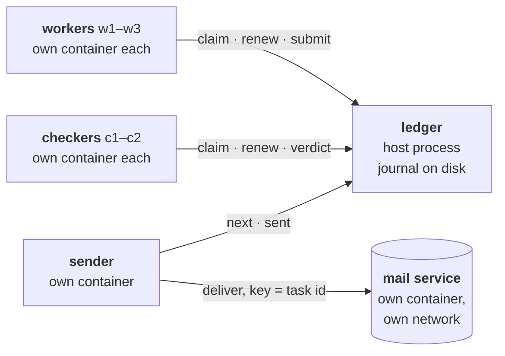
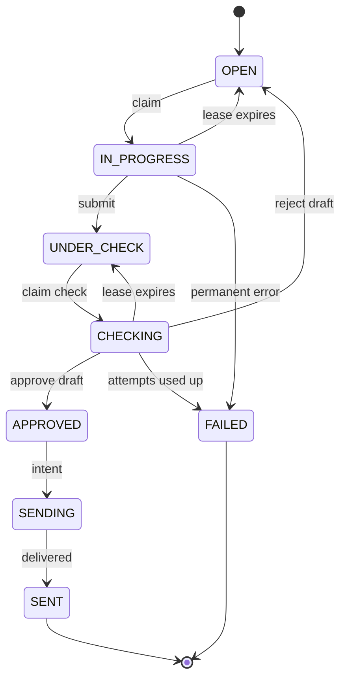

# Stage 8 — Reliable Task Ledger

Stage 7 ended with two problems. A worker that froze, was presumed dead and replaced, woke
up and **did its job anyway**: the customer received the email twice. And the coordinator
kept its records in memory, so **a crash erased every job**.

This stage replaces the coordinator with a **ledger**: one durable, authoritative record of
every task, with rules strict enough that crashes, retries, duplicated messages and zombies
cannot produce a wrong outcome. The exit criterion: **every failure in the declared scope has
explicit semantics, and every approved email is delivered exactly once, verified at the
receiver.**

The design was decided first, question by question, before any code (see *Design* below);
each experiment prints the prediction made then next to what happened.

## At a glance



Workers and checkers are on one container network; the mail service is alone on another,
which only the sender also joins. **A worker has no network route to the mail service**:
only the sender can cause the irreversible effect.

## The lifecycle



## Design: the decisions, in the order they were taken

1. **The life of a task.** First draft: open, in progress, under check, done; done is final; a
   failed check or a silent owner sends the task back to open. Sharpened: exactly one owner; a
   final FAILED state (permanent errors at once; transient ones up to an attempt budget); and
   the irreversible effect **after** approval, never during the work.
2. **Record or send first?** Found while answering: send then record, and a crash in between
   duplicates the email; record then send, and a crash loses it. No order works alone. So:
   record an intent (SENDING) with an idempotency key, send, record SENT; after a crash in
   SENDING, send again with the same key and let the receiver drop the repeat. The key is the
   task id (one approval per task, so one email per task), and the sender always sends the
   approved text stored in the ledger, never a regenerated one.
3. **Who sends?** A separate sender, so workers cannot touch the outside world at all.
4. **Telling the current owner from a previous one.** A per-task epoch, incremented on every
   claim and handed out as a token; renew, submit and give up must carry it; anything else is
   STALE and the requester stops. The counter is durable and only grows, and is **saved before
   the reply** (the other order can hand the same token to two workers after a crash).
5. **Time.** Only the ledger's clock decides expiry; clock disagreement cannot break safety,
   because fencing uses no time. After a ledger restart every held task gets a fresh full lease.
6. **The checker** is just another holder: it claims checks, holds a lease and a token, and its
   verdict names the exact draft it judged.
7. **Durability.** An append-only journal (a crash can only tear its last, never-acknowledged
   line), not a snapshot. After a restart: SENDING means "outcome unknown, send again with the
   key"; APPROVED means "certainly not sent yet".
8. **Repeats.** A retried submit with the same token and draft is answered "already accepted";
   a retried claim carries a request id and gets the same task and token back.

The theory behind each decision, with proofs: [chapter 8 of the theory companion](../docs/theory/08-ledgers-and-execution-semantics.md).

## Files

| File | Role |
|---|---|
| `ledger.py` | The ledger: the journal (append-only, checksummed, forced to disk before every reply), the legal transitions, epochs and tokens, leases on its own monotonic clock, recognised repeats, the SENDING intent. Pure logic, no network. |
| `test_ledger.py` | 23 tests, one per design rule; each was checked to fail when its rule is removed. |
| `wire.py` | Signed, versioned messages (Stage 7's HMAC scheme) and the retrying client. |
| `service.py` | The HTTP plumbing shared by both services: signature, role, version and schema checks, then one handler under a lock. |
| `ledger_service.py` | The ledger as a service; roles decide who may ask what; fault injection for crashes and slow replies. |
| `mail_service.py` | The outside world: deliveries that cannot be undone, deduplicated on a durable list of keys; its deliveries file is the ground truth. |
| `agent.py` | A worker or a checker (simulated drafting and checking, no model calls): claims, renews, stops at the first STALE, reports until answered. |
| `sender.py` | Takes approved tasks (or an unfinished SENDING), delivers with the task id as key until the outcome is known, marks SENT. |
| `lab.py` | Starts everything as processes (tests) or in containers on the lab host, and injects real failures (SIGKILL, SIGSTOP/SIGCONT). |
| `experiments.py` | The eight failure experiments and a counterfactual, each against its prediction. |
| `test_lab.py` | The exit criterion on real processes (~12 s). |

## Experiments

Each run starts a fresh system: 3 workers, 2 checkers, a sender, the mail service, 8 tasks.
The first draft of every fourth task is poor (rejected and redone); the last task has an
invalid address (FAILED). The invariant checked after every experiment: **every SENT task
delivered exactly once, no FAILED task delivered**, as recorded by the mail service itself.

| # | Failure injected | Prediction (made before the code) | Observed |
|---|---|---|---|
| 1 | a worker killed while holding a task | the lease runs out, the task is reopened and done once by another | expired → claimed by another (token 2) → sent once |
| 2 | a worker frozen until its task is reassigned, then thawed | its submit is invalid: the token was increased | refused STALE; the zombie discards its work |
| 3 | the first submit's reply held past the client timeout | "OK, already accepted" | the retry answered "duplicate"; one submit recorded |
| 4 | a checker frozen until its check is reassigned, then thawed | fencing holds for the checker too | its verdict refused STALE |
| 5 | the ledger exits after saving a claim, before replying | the retried claim gets the same task and token | restarted; claim replayed; no orphan, no expiry |
| 6 | the sender exits after delivery, before SENT | resend with the same key, no duplicate, then SENT | the task was still SENDING; resent; "duplicate"; one delivery |
| 7 | the mail service holds its first reply past the timeout | unclear; resend; not delivered twice | retried with the same key; suppressed; one delivery |
| 7′ | the same, **without** the receiver's memory of keys | (counterfactual) | **delivered twice**: the invariant breaks |
| 8 | the ledger down for twice the lease while work is in progress | fresh leases when it is back | none of the tasks in progress expired; all finished |

On processes: 8 of 8 mechanisms confirmed and the invariant held, in each of three full
rounds. The counterfactual is the point of the stage in one line: retries make sure the email
arrives; only the receiver's memory makes sure it arrives once.

### In containers on the lab host

The same eight experiments with every worker, checker, the sender and the mail service in
its own container on the Mac mini (Apple `container` 1.5, one lightweight VM each, 256 MB,
one CPU), the ledger a host process. Jobs and leases are stretched three times to absorb
the latency of signalling VMs (lease 3 s).

| # | Failure | Result | Time |
|---|---|---|---|
| 1 | worker killed holding T7 | expired → re-claimed by w3 (token 2) → sent once | 11.3 s |
| 2 | w1 frozen holding T4, then thawed | its submit refused STALE; w3's draft sent once | 13.6 s |
| 3 | first submit reply delayed | the retry answered "duplicate"; one submit recorded | 9.5 s |
| 4 | c1 frozen checking T1, then thawed | its verdict refused STALE; c2's verdict stands | 19.4 s |
| 5 | ledger exits after saving w1's claim of T1 | restarted; claim replayed with the same token; no orphan | 12.0 s |
| 6 | sender exits after delivering T1 | T1 still SENDING; resent; "duplicate"; one delivery | 9.4 s |
| 7 | mail reply delayed 2.5 s | retried with key T1; suppressed; one delivery | 9.6 s |
| 7′ | the same without the receiver's memory | **T1 delivered twice** | |
| 8 | ledger down 6 s with T2–T4 in progress | none expired after the restart; all finished | 20.1 s |

8 of 8 mechanisms confirmed; the invariant held in every experiment and broke, as it
should, only in the counterfactual. The network isolation was checked directly in the
same lab: from inside `w1` and `c1` a request to the mail service fails with no route;
from inside the sender it succeeds.

### What the first container run found

Two bugs that processes had hidden, both in the experiment harness rather than the ledger:
the freeze command stopped **itself** (its own shell's command line matched the pattern it was
searching for, so it never returned), and the experiments chose the task to watch from the
participant's first journal entry, which in containers was often already finished. Containers
are slower to signal, and that slowness exposed both.

## Running

```bash
python -m unittest test_ledger test_lab          # rules + exit criterion, ~15 s, offline
python experiments.py                            # all eight on processes, ~30 s
python experiments.py --backend container        # on the lab host: everything in containers
```

The container backend needs Apple's `container` (`container system start` after a reboot).
It runs the official `python:3.12-slim` image unchanged, with the code and the one dependency
(pydantic, Linux wheels fetched once with `uv`) mounted read-only: nothing is built.

## What this stage does not establish

- **One ledger.** It is a single process on a single host: durable, not available. If the lab
  host is down, nothing moves. Replicating it (and what that does to the epoch counter) is
  Stage 9.
- **Honest participants.** Fencing assumes a stale worker presents the token it was given.
  Messages are authenticated, so no one can act as another participant, but a participant that
  lies is a Byzantine fault (Stages 10–11).
- **A receiver that deduplicates.** The guarantee is only as good as the mail service's memory
  of keys. A real service without idempotency keys leaves a timed-out send genuinely unknown;
  the honest answer then is to stop and ask a person, not to guess.
- **Simulated work.** Drafting and checking are deterministic stand-ins; no model is called.
  Putting real agents behind the ledger changes nothing in its rules, which is the point.
- **One sender.** Two senders would both be safe (keys), but could race on the same task; we
  did not need more than one.
